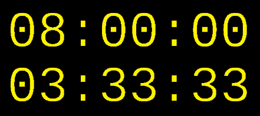
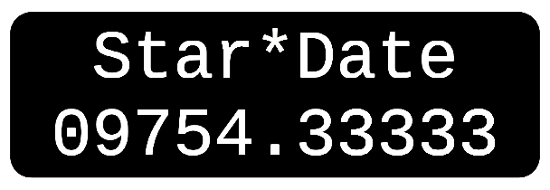
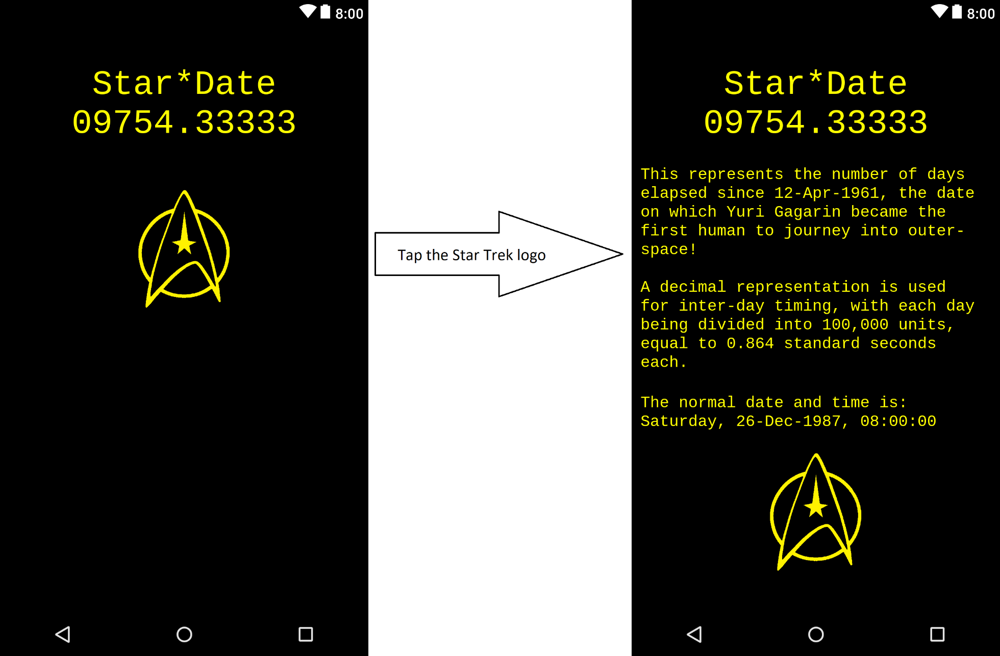

# Star*Date
##### _&copy; 2019 by Aaron Weatherly_
<p><br></p>

### Overview:
Have you ever wondered why a day has 24 hours, each with 60 minutes, and 60 seconds per minute? That divides each day into **86,400** equal units of time... 

This seems pretty arbitrary to me, but it goes back to the ancient Sumerians and their [sexagesimal][wiki] (base 60) numbering system. Keeping time in this fashion has made sense for a long while, and all of us are well and used to it by now, but I think we can do better...

This repository includes Windows gadgets and Android apps/widgets that allow for the telling of time in decimal format. That's right, base 10, as any reasonable measuring system ought to be in the modern era. To accomplish this, let's redefine our time steps so that there are **100,000** equal units in a day. And while we're at it, let's call these units "deconds" to alleviate any confusion between the decimal second and a sexagesimal second. Now we have:
```
1 "decond" equals 0.864 seconds
100 "deconds" equals 1 "dinute"
100 "dinutes" equals 1 "dour"
10  "dours" equals 1 day
```
This is equally arbitrary, but much more mathematically pleasing IMHO.
<p><br></p>

### Features:
There are several gadgets/widgets available, and the most basic one simply displays the current local time in the 24 hour format as well as the associated decimal time:
<p>

<br>
</p>
A variation of this gadget/widget converts the decimal time into something resembling a "Star*Date":
<p>

<br>
</p>
The Android app also includes a basic button function to show/hide some additional information (and play a familiar sound effect) when clicked:
<p>

<br>
</p>
<p><br></p>

### Installation:
To install the Android app and widgets, simply download the following .apk file and install directly to your Android device. You may have to enable 3rd party apps in your settings first.
- [StarDate.apk][apk]

For the Windows gadgets, it depends on what version you are running. For older versions with the gadget features built in, Windows 7 for example, simply download the following .gadget files and double click on them to initiate the installation:
- [DeciWatch.gadget][gad1]
- [StarDate.gadget][gad2]

For Windows 10, first download and install [DesktopGadgetsRevived-2.0.exe][win10] on your machine. Then install the gadgets the same as before. 

Now you can right click on your Desktop, open the Gadget Gallery, and the new gadgets will be there for you to add to your Desktop.

Additionally, all source code is provided in this repo in case you want to compile it yourself and/or make any tweaks to the formatting and style.
<p><br></p>

### How it Works:
Initially, this started as a simple `python` [script][py] to be run from a terminal:
```python
from datetime import datetime
from time import sleep
from os import system, name

def clear():
    if (name=='nt'):
        system('cls')
    else:
        system('clear')

try:
    while True:
        t = str(datetime.now().time())
        (h,m,s) = t.split(':')
        sec = float(h)*3600 + float(m)*60 + float(s)
        dec = sec/0.864
        dh = int(dec/10000)
        dm = int((dec - dh*10000)/100)
        ds = int(dec-dh*10000-dm*100)
        print('The Current Decimal Time is '+str(dh)+':'+f'{dm:02d}'+':'+f'{ds:02d}')
        print('Press Ctrl+C to Exit')
        sleep(0.864/10)
        clear()  
except KeyboardInterrupt: 
    pass
```
This simply queries the current local system time, calculates how many seconds have elapsed since midnight, then converts this to deconds, formats the result as desired, and prints to the screen.
<p><br></p>

The Windows gadget operates very similarly, but the [script][js] is written in `JavaScript`:
```javascript
function init() {
	// format gadget size
	document.body.style.width = 136;
	document.body.style.height = 58;
	
	// run the main function
	main();
}

function main() {
	// get the current time
	var date = new Date();
	var h = date.getHours();
	var m = date.getMinutes();
	var s = date.getSeconds();
	var ms = date.getMilliseconds();
	
	// convert time to seconds, then "dours/dinutes/deconds"
	var sec = h*3600 + m*60 + s + ms/1000;
	var dec = sec/0.864;
	var dh = Math.floor(dec/10000);
	var dm = Math.floor((dec - dh*10000)/100);
	var ds = Math.floor(dec-dh*10000-dm*100);
	
	// format with leading zero if less than 10
	h = (h < 10)? "0" + h : h;
	m = (m < 10)? "0" + m : m;
	s = (s < 10)? "0" + s : s;
	dm = (dm < 10)? "0" + dm : dm;
	ds = (ds < 10)? "0" + ds : ds;
	
	// construct times as strings with colon separators
	var time = h + ":" + m + ":" + s;
	var dtime = "0" + dh + ":" + dm + ":" + ds;
	
	// make variables available to html
	document.getElementById("time").innerHTML = time;
	document.getElementById("dtime").innerHTML = dtime;
	
	// update every 96 milliseconds
	setTimeout(main,96);
}
```
And is called from an [html][html] file:
```html
<html>
	<head><script type="text/javascript" src="DeciWatch.js"/></script></head>
	<body onload="init();">
		<g:background 
			id="bg" 
			src="bg.png" 
			style="position:absolute;top:0;left:0;"       
			opacity="100">
		<p style="font-size:28px; color:yellow; font-family:courier new;">
			<span id="time"></span><br>
			<span id="dtime"></span>
		</p>
	</body>
</html>
```
<p><br></p>

Porting the same functionality over to the Android side of things was a bit more complicated. The calculations are the same, just adapted for `Java` using `Joda-Time`. Here is a snippet from the `updateAppWidget` method of the widget provider class:
```java
LocalDateTime today = new LocalDateTime();
int h = today.getHourOfDay();
int m = today.getMinuteOfHour();
int s = today.getSecondOfMinute();
int ms = today.getMillisOfSecond();
float sec = h * 3600 + m * 60 + s + (float) ms/1000;
int dec = (int) Math.floor(sec / .864);
int dh = (int) (dec / 10000);
int dm = (int) ((dec - dh * 10000) / 100);
int ds = (int) (dec - dh * 10000 - dm * 100);
String dtime = String.format(Locale.getDefault(),
	"\n%02d:%02d:%02d\n%02d:%02d:%02d", h, m, s, dh, dm, ds);
```
Where it gets interesting is in updating the widgets at regular intervals. The minimum standard update interval for Android widgets is 30 minutes, which is set by including `android:updatePeriodMillis="1800000"` in the [resource file][xml]. 

We want updates at least every "decond" in this case, or 864 milliseconds, so the standard approach is insufficient. To get around this, the widget updates are done primarily with a `Handler` at an interval of 96 milliseconds. This is occasionally killed by the OS, so I also use an `AlarmManager` to trigger the update every "dinute". If the updates stop for any reason, you should only have to wait a maximum of 86.4 seconds before regular updates resume. See [MainAppWidget.java][java] for the full solution:
```java
package aaron.deciwatch;

import android.app.AlarmManager;
import android.app.PendingIntent;
import android.appwidget.AppWidgetManager;
import android.appwidget.AppWidgetProvider;
import android.content.ComponentName;
import android.content.Context;
import android.content.Intent;
import android.os.Handler;
import android.widget.RemoteViews;
import org.joda.time.LocalDateTime;
import java.util.Calendar;
import java.util.Locale;
import static android.appwidget.AppWidgetManager.ACTION_APPWIDGET_UPDATE;

public class MainAppWidget extends AppWidgetProvider {

    private PendingIntent RepeatingIntent(Context context) {
        Intent intent = new Intent(ACTION_APPWIDGET_UPDATE);
        PendingIntent pendingIntent = PendingIntent.getBroadcast(context, 0, intent, PendingIntent.FLAG_UPDATE_CURRENT);
        return pendingIntent;
    }

    @Override
    public void onReceive(Context context, Intent intent) {
        super.onReceive(context, intent);
        if (ACTION_APPWIDGET_UPDATE.equals(intent.getAction())) {
            ComponentName thisAppWidget = new ComponentName(context.getPackageName(), getClass().getName());
            AppWidgetManager appWidgetManager = AppWidgetManager.getInstance(context);
            int[] ids = appWidgetManager.getAppWidgetIds(thisAppWidget);
            for (int appWidgetID : ids) {
                updateAppWidget(context, appWidgetManager, appWidgetID);
            }
        }
    }

    @Override
    public void onDisabled(Context context) {
        super.onDisabled(context);
        AlarmManager alarmManager = (AlarmManager) context.getSystemService(Context.ALARM_SERVICE);
        alarmManager.cancel(RepeatingIntent(context));
    }

    @Override
    public void onEnabled(Context context) {
        super.onEnabled(context);
        AlarmManager alarmManager = (AlarmManager) context.getSystemService(Context.ALARM_SERVICE);
        Calendar start = Calendar.getInstance();
        start.setTimeInMillis(System.currentTimeMillis());
        LocalDateTime now = new LocalDateTime();
        int h = now.getHourOfDay();
        int m = now.getMinuteOfHour();
        int s = now.getSecondOfMinute();
        int ms = now.getMillisOfSecond();
        float sec = h * 3600 + m * 60 + s + (float) ms/1000;
        int delay = (int) Math.round((100-(sec/.864)%100)*864);
        start.add(Calendar.MILLISECOND, delay);
        alarmManager.setRepeating(AlarmManager.RTC, start.getTimeInMillis(), 86400, RepeatingIntent(context));
    }

    @Override
    public void onUpdate(Context context, AppWidgetManager appWidgetManager, int[] appWidgetIds) {
        // There may be multiple widgets active, so update all of them
        for (int appWidgetId : appWidgetIds) {
            updateAppWidget(context, appWidgetManager, appWidgetId);
        }
    }

    public static void updateAppWidget(final Context context, final AppWidgetManager appWidgetManager, final int appWidgetId) {
        LocalDateTime today = new LocalDateTime();
        int h = today.getHourOfDay();
        int m = today.getMinuteOfHour();
        int s = today.getSecondOfMinute();
        int ms = today.getMillisOfSecond();
        float sec = h * 3600 + m * 60 + s + (float) ms/1000;
        int dec = (int) Math.floor(sec / .864);
        int dh = (int) (dec / 10000);
        int dm = (int) ((dec - dh * 10000) / 100);
        int ds = (int) (dec - dh * 10000 - dm * 100);
        String dtime = String.format(Locale.getDefault(),
                "%02d:%02d:%02d\n%02d:%02d:%02d", h, m, s, dh, dm, ds);

        // Construct the RemoteViews object
        RemoteViews views = new RemoteViews(context.getPackageName(), R.layout.main_app_widget);
        views.setTextViewText(R.id.main_widget_text, dtime);
        // Instruct the widget manager to update the widget
        appWidgetManager.updateAppWidget(appWidgetId, views);

        new Handler().postDelayed(new Runnable(){
            public void run(){
                updateAppWidget(context, appWidgetManager, appWidgetId);
            }
        },96);
    }
}
```
<p><br></p>


[wiki]:https://en.wikipedia.org/wiki/Sexagesimal
[apk]:https://github.com/weatherman03/DeciWatch/raw/master/Android/StarDate/app/release/StarDate.apk
[gad1]:https://github.com/weatherman03/DeciWatch/raw/master/Windows/DeciWatch.gadget
[gad2]:https://github.com/weatherman03/DeciWatch/raw/master/Windows/StarDate/StarDate.gadget
[win10]:https://github.com/weatherman03/DeciWatch/raw/master/Windows/DesktopGadgetsRevived-2.0.exe
[py]:https://github.com/weatherman03/DeciWatch/blob/master/Reference/Old%20Code/decimal_time_v2.py
[js]:https://github.com/weatherman03/DeciWatch/blob/master/Windows/src/DeciWatch.js
[html]:https://github.com/weatherman03/DeciWatch/blob/master/Windows/src/DeciWatch.html
[xml]:https://github.com/weatherman03/DeciWatch/blob/master/Android/DeciWatch/app/src/main/res/xml/main_app_widget_info.xml
[java]:https://github.com/weatherman03/DeciWatch/blob/master/Android/DeciWatch/app/src/main/java/aaron/deciwatch/MainAppWidget.java